# API 文档生成器 (API Doc Generator)

> 🌿 **分支**: `feature/model-b-fullstack` — Deno + React SPA 实现方案

一个基于 **Deno + React** 的全栈 API 文档生成工具，支持从 API 规范一键生成精美的 Markdown / HTML / JSON 文档。

## 📑 目录

- [✨ 特性](#-特性)
- [🏗️ 核心架构](#️-核心架构)
  - [数据流](#数据流)
- [🏗️ 技术栈](#️-技术栈)
- [📁 项目结构](#-项目结构)
  - [后端模块依赖关系](#后端模块依赖关系)
  - [前端组件关系](#前端组件关系)
- [🚀 快速开始](#-快速开始)
  - [开发工作流](#开发工作流)
- [📖 使用指南](#-使用指南)
- [🧪 测试](#-测试)
  - [测试架构](#测试架构)
  - [测试金字塔](#测试金字塔)
- [📝 API 规范](#-api-规范)
  - [核心数据模型](#核心数据模型)
- [🔧 配置](#-配置)
  - [配置加载流程](#配置加载流程)
  - [输出格式对比](#输出格式对比)
- [📦 部署](#-部署)
  - [部署架构](#部署架构)
  - [CI/CD 流水线](#cicd-流水线)
- [🔀 与其他分支的对比](#️-与其他分支的对比)
- [🤝 贡献](#-贡献)
- [📄 许可证](#-许可证)

## ✨ 特性

- 🚀 **全栈一体**：Deno 后端 + React 前端，单一部署，开箱即用
- 🎨 **现代 UI**：使用 Tailwind CSS 构建，简洁美观的响应式界面
- 📝 **多格式输出**：支持 Markdown、HTML、JSON 三种文档格式
- 🔌 **OpenAPI 支持**：可直接导入 OpenAPI 3.0 / Swagger 规范
- 🌐 **RESTful API**：提供完整的 HTTP API 接口（generate、health、import/openapi、static）
- ⚡ **高性能**：Deno 原生运行，零依赖，启动迅速
- 🛡️ **类型安全**：全 TypeScript 编写，端到端类型安全
- 🔄 **热重载**：后端 deno task dev + 前端 Vite HMR

## 🏗️ 核心架构

系统采用前后端分离的全栈架构，前端负责交互与展示，后端承担文档生成的核心逻辑。

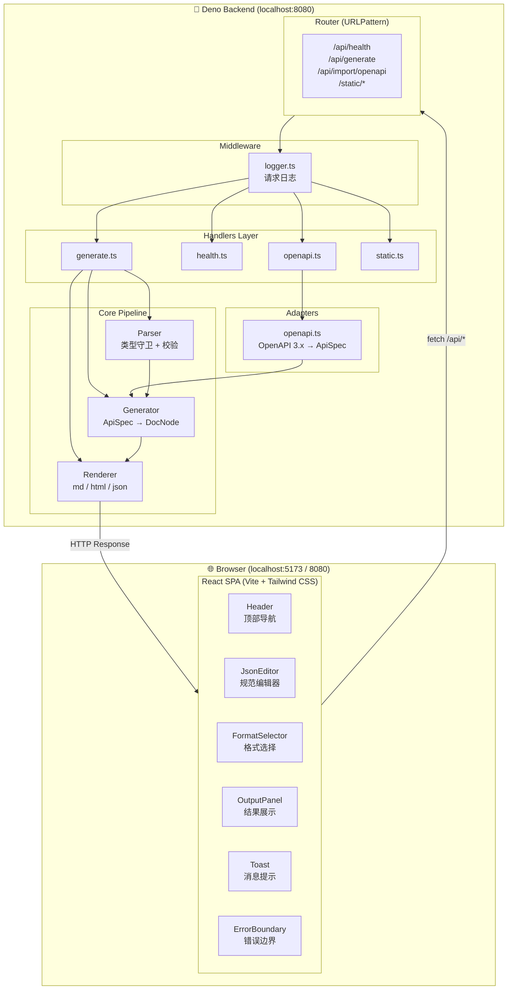

### 数据流

完整的文档生成请求链路如下：

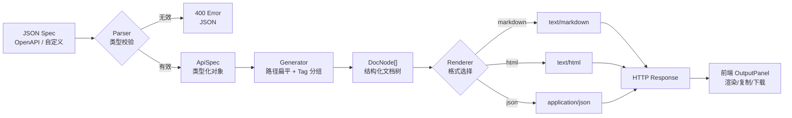

请求/响应的详细时序：

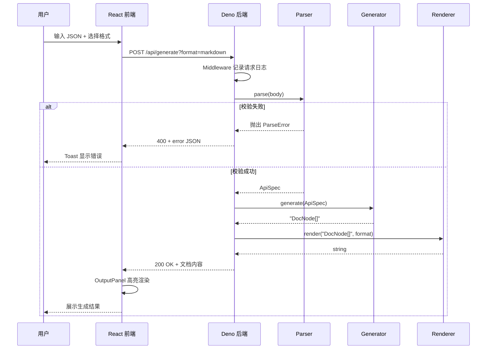

## 🏗️ 技术栈

### 后端
- **Deno** 1.40+ — 现代 JavaScript/TypeScript 运行时
- **TypeScript** (strict mode) — 类型安全的 JavaScript
- **URLPattern** — 原生路由匹配
- **@std/media-types** — MIME 类型处理

### 前端
- **React 18** — 主流前端框架
- **TypeScript** — 类型安全
- **Vite 5** — 快速的构建工具
- **Tailwind CSS 3** — 实用优先的 CSS 框架
- **React Router** — 客户端路由

## 📁 项目结构

```
api-doc-generator/
├── backend/                 # Deno 后端
│   ├── main.ts             # 应用入口
│   ├── router.ts           # URLPattern 路由配置
│   ├── deno.json           # Deno 配置 + tasks
│   ├── deno.lock           # 依赖锁定
│   ├── handlers/           # HTTP 请求处理器
│   │   ├── generate.ts     # /api/generate 文档生成
│   │   ├── health.ts       # /api/health 健康检查
│   │   ├── openapi.ts      # /api/import/openapi OpenAPI 导入
│   │   └── static.ts       # 静态文件服务
│   ├── core/               # 核心业务逻辑
│   │   ├── generator.ts    # ApiSpec → DocNode 转换
│   │   ├── parser.ts       # 类型守卫与解析
│   │   └── renderer.ts     # DocNode → 文档渲染
│   ├── adapters/           # 适配器
│   │   └── openapi.ts      # OpenAPI 3.x → ApiSpec 转换
│   ├── middleware/         # 中间件
│   │   └── logger.ts       # 请求日志
│   ├── types/              # 类型定义
│   │   ├── api_spec.ts     # ApiSpec 类型
│   │   └── doc_node.ts     # DocNode 类型
│   └── tests/              # 测试文件
│       ├── generator_test.ts
│       ├── integration_test.ts
│       ├── openapi_test.ts
│       ├── parser_test.ts
│       ├── renderer_test.ts
│       └── static_test.ts
│
├── frontend/               # React 前端 (独立 Vite 项目)
│   ├── src/
│   │   ├── App.tsx         # 主应用组件
│   │   ├── main.tsx        # 入口文件
│   │   ├── index.css       # Tailwind 样式
│   │   ├── types.ts        # 前端类型
│   │   ├── api/
│   │   │   └── client.ts   # API 客户端
│   │   ├── components/
│   │   │   ├── Header.tsx
│   │   │   ├── JsonEditor.tsx
│   │   │   ├── FormatSelector.tsx
│   │   │   ├── OutputPanel.tsx
│   │   │   ├── Toast.tsx
│   │   │   └── ErrorBoundary.tsx
│   │   └── utils/
│   │       ├── markdown.ts # Markdown 渲染
│   │       └── sample.ts   # 示例数据
│   ├── index.html
│   ├── package.json
│   ├── vite.config.ts      # 含 proxy 到后端
│   ├── tailwind.config.js
│   └── tsconfig.json
│
├── scripts/                # 脚本目录
│   └── dev.sh              # 开发环境管理脚本
│
├── config/                 # 配置目录
│   └── env.example         # 环境变量模板
│
├── examples/               # 示例文件
│   └── openapi/
│       └── petstore.json   # OpenAPI 示例
│
├── docs/                   # 文档目录
│
├── Dockerfile              # Docker 配置
├── docker-compose.yml      # Docker Compose 配置
├── .dockerignore           # Docker 忽略文件
└── README.md               # 项目说明
```

### 后端模块依赖关系

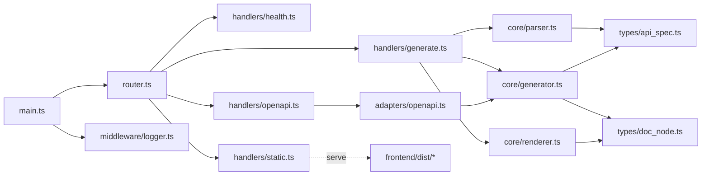

### 前端组件关系

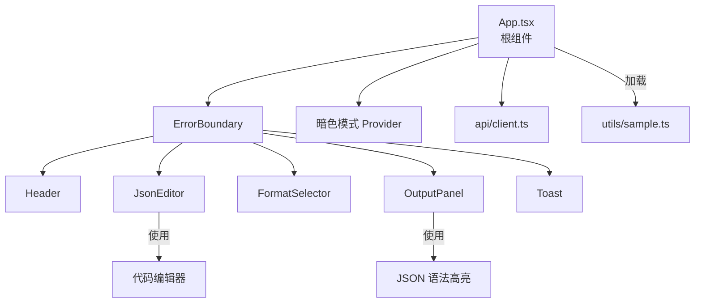

## 🚀 快速开始

本项目提供了一个便捷的开发环境管理脚本 `scripts/dev.sh`，可以一键启动、停止前后端服务。

```bash
# 启动前后端（自动检测并安装依赖）
./scripts/dev.sh start

# 查看服务状态
./scripts/dev.sh status

# 停止所有服务
./scripts/dev.sh stop

# 重启所有服务
./scripts/dev.sh restart

# 仅启动/停止后端
./scripts/dev.sh start:backend
./scripts/dev.sh stop:backend

# 仅启动/停止前端
./scripts/dev.sh start:frontend
./scripts/dev.sh stop:frontend

# 查看实时日志
./scripts/dev.sh logs backend    # 后端日志
./scripts/dev.sh logs frontend   # 前端日志

# 清理日志和 PID 文件
./scripts/dev.sh clean

# 查看所有命令
./scripts/dev.sh help
```

启动后访问：
- 前端: http://localhost:5173
- 后端: http://localhost:8080

### 开发工作流

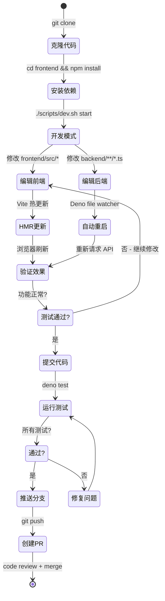

### 前置要求

- [Deno](https://deno.land/) 1.40+
- [Node.js](https://nodejs.org/) 18+ (用于前端构建)
- npm 9+

### 安装与运行

#### 1. 克隆项目

```bash
git clone <your-repo-url>
cd api-doc-generator
```

#### 2. 构建前端

```bash
cd frontend
npm install
npm run build
cd ..
```

#### 3. 启动后端服务

```bash
cd backend
deno run --allow-net --allow-read --allow-env main.ts
```

或者使用任务命令：

```bash
cd backend
deno task start
```

服务将在 `http://localhost:8080` 启动。

#### 4. 访问应用

打开浏览器访问 `http://localhost:8080`，即可使用 API 文档生成器。

### 开发模式

#### 后端热重载

```bash
cd backend
deno task dev
```

#### 前端开发服务器（带热更新）

```bash
cd frontend
npm run dev
```

前端开发服务器将在 `http://localhost:5173` 运行，并自动代理 API 请求到后端 `http://localhost:8080`。

## 📖 使用指南

### Web 界面

1. 打开 `http://localhost:8080`（或开发模式 `http://localhost:5173`）
2. 在 JSON 编辑器中输入 API 规范（自定义格式或 OpenAPI 3.0）
3. 点击「示例」按钮加载示例数据
4. 选择输出格式（Markdown / HTML / JSON）
5. 点击「生成文档」按钮
6. 查看右侧输出结果，支持复制和下载

### REST API

#### 健康检查

```bash
GET /api/health
```

响应：
```json
{
  "status": "ok",
  "timestamp": "2024-01-01T00:00:00.000Z"
}
```

#### 生成文档

```bash
POST /api/generate?format=markdown|html|json
Content-Type: application/json

{
  "info": {
    "title": "My API",
    "version": "1.0.0",
    "description": "API 描述"
  },
  "paths": {
    "/users": {
      "get": {
        "summary": "获取用户列表",
        "responses": {
          "200": { "description": "成功" }
        }
      }
    }
  }
}
```

**curl 示例**：
```bash
curl -X POST 'http://localhost:8080/api/generate?format=markdown' \
  -H 'Content-Type: application/json' \
  -d '{"info":{"title":"My API","version":"1.0.0"},"paths":{"/users":{"get":{"summary":"List users","responses":{"200":{"description":"OK"}}}}}}'
```

#### 导入 OpenAPI

```bash
POST /api/import/openapi?format=markdown
Content-Type: application/json

{
  "openapi": "3.0.0",
  "info": {
    "title": "Pet Store",
    "version": "1.0.0"
  },
  "paths": {
    "/pets": {
      "get": {
        "summary": "获取宠物列表",
        "responses": {
          "200": { "description": "成功" }
        }
      }
    }
  }
}
```

## 🧪 测试

### 测试架构

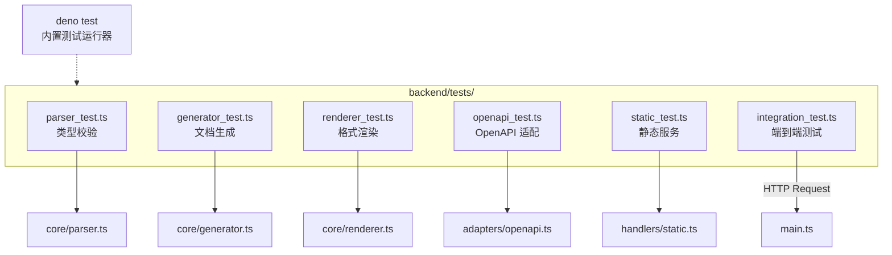

### 测试金字塔

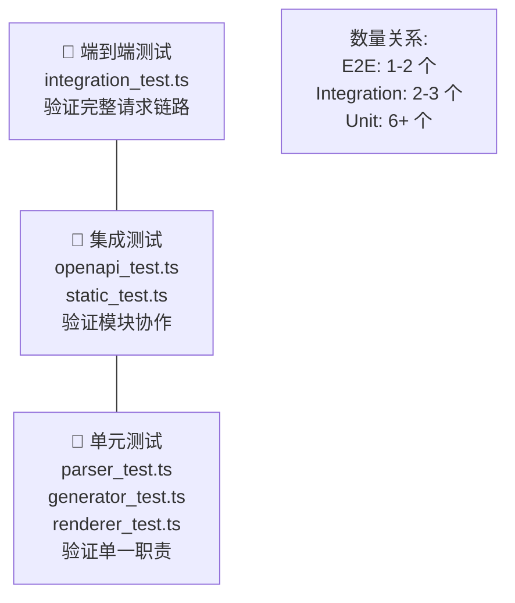

运行所有测试：

```bash
cd backend
deno test --allow-net --allow-read
```

运行特定测试：

```bash
cd backend
deno test --allow-net --allow-read tests/integration_test.ts
```

## 📝 API 规范

### 核心数据模型

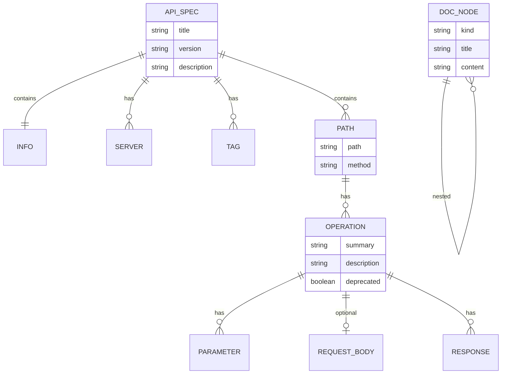

### 自定义 API 规范

```json
{
  "info": {
    "title": "API 标题",
    "version": "1.0.0",
    "description": "API 描述（可选）"
  },
  "servers": [
    { "url": "https://api.example.com", "description": "生产环境" }
  ],
  "tags": [
    { "name": "用户管理", "description": "用户相关接口" }
  ],
  "paths": {
    "/users": {
      "get": {
        "summary": "获取用户列表",
        "description": "详细描述",
        "tags": ["用户管理"],
        "parameters": [
          {
            "name": "page",
            "in": "query",
            "required": false,
            "description": "页码",
            "schema": { "type": "integer" }
          }
        ],
        "requestBody": {
          "required": true,
          "content": {
            "application/json": {
              "schema": { "type": "object" }
            }
          }
        },
        "responses": {
          "200": {
            "description": "成功",
            "content": {
              "application/json": {
                "schema": { "type": "object" }
              }
            }
          }
        }
      }
    }
  }
}
```

### OpenAPI 3.0 导入

直接粘贴标准的 OpenAPI 3.0 规范 JSON，系统会自动转换为内部文档格式。

## 🔧 配置

### 环境变量

复制 `config/env.example` 为 `.env` 并按需修改：

```bash
cp config/env.example .env
```

可用配置项：

| 变量 | 默认值 | 说明 |
|------|--------|------|
| `PORT` | 8080 | 服务端口 |
| `HOST` | 0.0.0.0 | 服务主机地址 |
| `DENO_ENV` | development | 运行环境 |
| `LOG_LEVEL` | info | 日志级别 |
| `CORS_ALLOWED_ORIGINS` | http://localhost:5173 | CORS 允许的来源 |

### Deno 权限

运行应用需要以下权限：

- `--allow-net` — 网络访问
- `--allow-read` — 读取静态文件
- `--allow-env` — 读取环境变量

### 配置加载流程

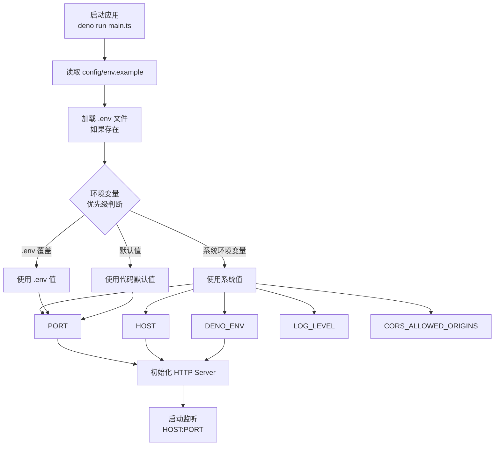

### 输出格式对比

| 维度 | Markdown | HTML | JSON |
|------|----------|------|------|
| **MIME Type** | `text/markdown` | `text/html` | `application/json` |
| **用途** | 文档系统、Wiki、Git 仓库 | 浏览器直接查看 | 程序处理、API 响应 |
| **样式** | 纯文本 + 标记 | 内联 CSS 美化 | 无样式，结构化数据 |
| **可读性** | 高（人类友好） | 最高（可视化） | 中（需要解析） |
| **可移植性** | 极高 | 高 | 极高 |
| **生成复杂度** | 低 | 中 | 低 |

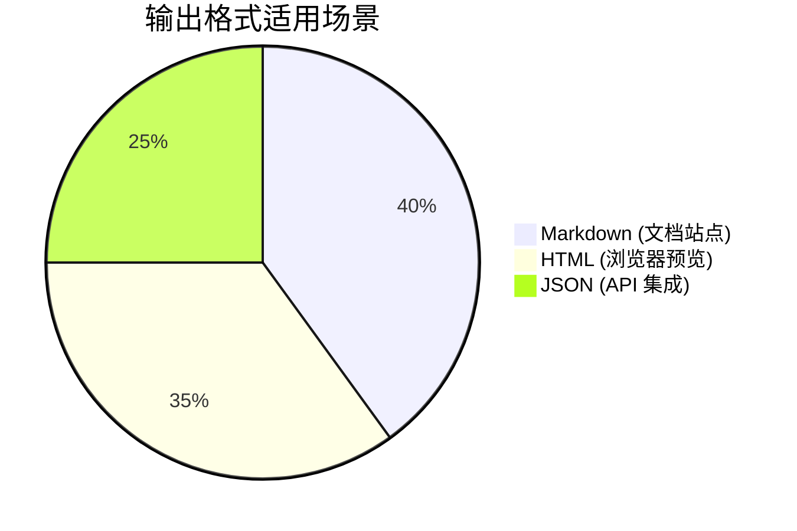

## 📦 部署

### 生产构建

```bash
# 构建前端
cd frontend && npm run build && cd ..

# 启动服务
cd backend
deno run --allow-net --allow-read --allow-env main.ts
```

### Docker 部署

项目包含完整的 Docker 配置，可以直接使用：

```bash
# 使用 docker-compose 一键启动
docker-compose up --build

# 或手动构建
docker build -t api-doc-generator .
docker run -p 8080:8080 api-doc-generator
```

#### 部署架构

**单机 Docker 部署**:

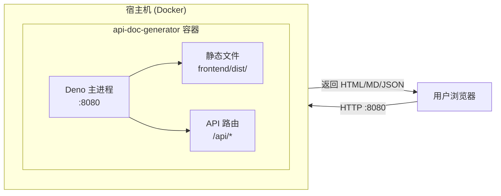

**docker-compose 多服务架构**:

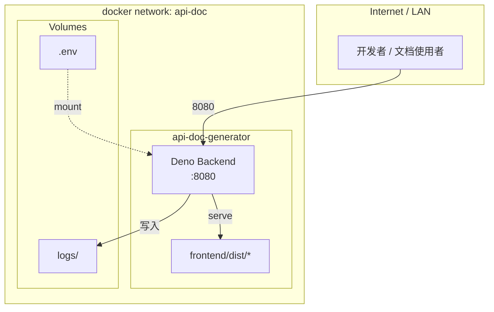

### CI/CD 流水线

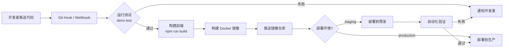

## 🔀 与其他分支的对比

本项目有三个功能分支，分别代表不同的技术选型：

| 特性 | model-a | model-b (本分支) | model-c |
|------|---------|-----------------|---------|
| 后端运行时 | Node.js + Express | Deno 原生 | Deno + Fresh |
| 前端框架 | React + Vite | React + Vite | Preact + Fresh Islands |
| 路由 | Express Router | URLPattern | Fresh File-based Routes |
| 类型系统 | TypeScript | TypeScript | TypeScript |
| 包管理 | npm | Deno imports + npm (frontend) | Deno JSR |

### 技术选型对比图

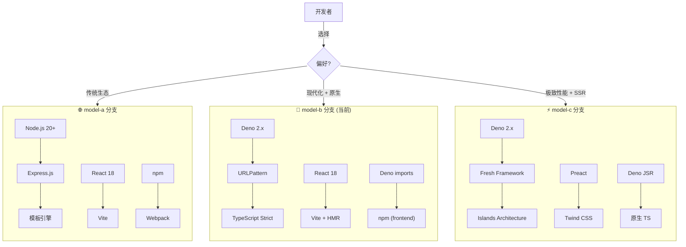

## 🤝 贡献

欢迎提交 Issue 和 Pull Request！

## 📄 许可证

MIT License

## 🙏 致谢

- [Deno](https://deno.land/) — 现代 JavaScript/TypeScript 运行时
- [React](https://react.dev/) — 用户界面构建库
- [Vite](https://vitejs.dev/) — 下一代前端构建工具
- [Tailwind CSS](https://tailwindcss.com/) — 实用优先的 CSS 框架
