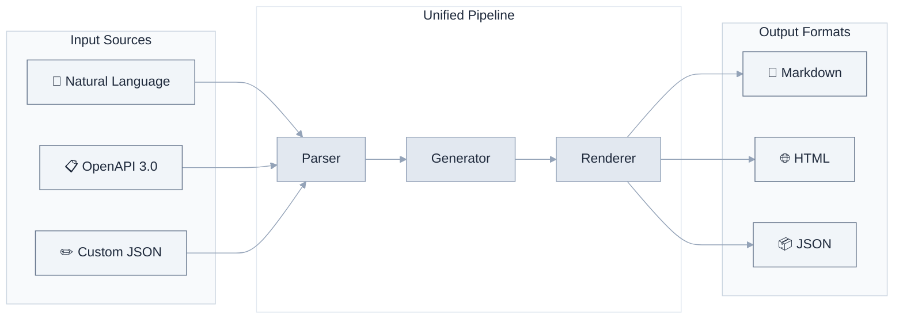
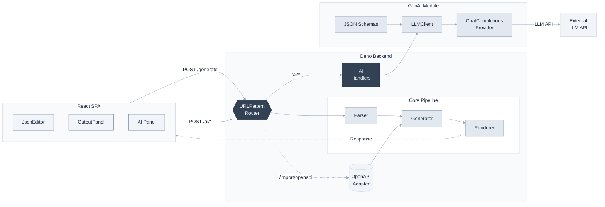

# 🧠 API Doc Generator — AI-Powered API Documentation

<div align="center">

**Describe your API in plain English. Get beautiful docs in seconds.**

From natural language, OpenAPI specs, or custom definitions → Markdown / HTML / JSON — all running locally, no data ever leaves your server.

[](https://deno.land)
[](https://react.dev)
[](https://www.typescriptlang.org)
[](https://platform.openai.com/docs/guides/structured-outputs)
[](LICENSE)

[中文文档](docs/README.zh-CN.md)

</div>

---

## Why this tool?

Most API doc tools force you to **already have** an OpenAPI spec. You either write it by hand (tedious) or use heavy GUI editors (slow, vendor lock-in). This tool is different:



**Three input paths, one pipeline, zero vendor lock-in.** Pick whichever works for you.

### How we compare

|  | API Doc Generator | Swagger UI | Redoc | Postman | Stoplight |
|---|---|---|---|---|---|
| **Natural language → docs** | ✅ AI-powered | ❌ | ❌ | ⚠️ AI Agent (cloud) | ❌ |
| **Custom spec format** | ✅ simple JSON | ❌ | ❌ | ❌ | ❌ |
| **Import OpenAPI 3.0** | ✅ | ✅ | ✅ | ✅ | ✅ |
| **Output Markdown** | ✅ | ❌ | ❌ | ❌ | ❌ |
| **Output HTML** | ✅ stylish single-page | ✅ interactive | ✅ beautiful | ⚠️ published portal | ✅ interactive |
| **Output JSON** | ✅ | ❌ | ❌ | ❌ | ❌ |
| **Streaming AI generation** | ✅ SSE | ❌ | ❌ | ❌ | ❌ |
| **Self-hosted** | ✅ docker-compose up | ✅ | ✅ | ⚠️ SaaS, local MCP | ⚠️ Enterprise only |
| **Open source** | ✅ MIT | ✅ Apache 2.0 | ✅ MIT | ❌ | ❌ |
| **Lightweight** | ✅ ~7k LOC | ✅ | ✅ | ❌ | ❌ |

> **Notes:**
> - **Swagger UI** is the open-source renderer. SmartBear (its parent company) launched AI-powered spec generation in 2025, but that's a separate cloud product (SwaggerHub), not Swagger UI itself.
> - **Postman** added Agent Mode (AI) for doc generation, but it consumes AI credits and runs on Postman's cloud. The MCP server is open-source for local bridging, but the core platform is proprietary SaaS.
> - **Redoc** renders Markdown *within* OpenAPI descriptions but does not output standalone `.md` files.
> - **Stoplight** is proprietary SaaS. Self-hosted Git integration requires Enterprise plan (custom pricing).

### ✨ Features

- **🧠 AI-powered generation** — Describe your API in plain English, get a valid OpenAPI 3.0 spec. Uses JSON Schema structured output to guarantee correctness, with automatic fallback and local validation.
- **📋 OpenAPI import** — Already have an OpenAPI spec? Paste it in and get instant docs.
- **✏️ Custom spec format** — A lightweight JSON format for when you don't need the full OpenAPI complexity.
- **📄 Multi-format output** — Generate clean Markdown, stylish standalone HTML, or machine-readable JSON.
- **⚡ Streaming AI** — Watch the AI generate your API spec in real-time via SSE, with live character count and elapsed time.
- **🌙 Dark mode** — Full light/dark theme support across the entire UI.
- **🐳 One-command deploy** — `docker-compose up --build` and you're running.
- **🔒 Data never leaves your server** — All processing is local. No cloud, no telemetry, no vendor lock-in.
- **🏗️ Clean architecture** — Deno backend + React frontend + standalone GenAI module. Each layer independently testable.
- **✅ Production-ready CI** — GitHub Actions with fmt → lint → type-check → test → build on every PR.

### 🖼️ Preview

<table>
  <tr>
    <td align="center" width="50%">
      <br/>
      <em>Standard Mode — paste a spec, get docs</em>
    </td>
    <td align="center" width="50%">
      <br/>
      <em>AI Mode — describe in plain English, watch it generate</em>
    </td>
  </tr>
</table>

### 🏗️ Architecture



### 🚀 Quick Start

#### Prerequisites

- Deno 2.x
- Node.js 18+

#### One-command setup

```bash
./scripts/dev.sh start      # Start both frontend & backend
./scripts/dev.sh status     # Check status
./scripts/dev.sh stop       # Stop services
./scripts/dev.sh restart    # Restart
```

Visit **http://localhost:8080**

#### Manual setup

```bash
# Build frontend
cd frontend && npm install && npm run build && cd ..

# Start backend
cd backend && deno task start
```

### 📖 API Usage

#### Generate documentation

```bash
POST /generate?format=markdown|html|json

curl -X POST 'http://localhost:8080/generate?format=markdown' \
  -H 'Content-Type: application/json' \
  -d '{
    "info": { "title": "My API", "version": "1.0.0" },
    "paths": {
      "/users": {
        "get": {
          "summary": "List users",
          "responses": { "200": { "description": "OK" } }
        }
      }
    }
  }'
```

#### Import OpenAPI

```bash
POST /import/openapi?format=markdown
# Send OpenAPI 3.0 JSON directly
```

#### AI: Ping (test LLM connection)

```bash
POST /ai/ping
# → { "ok": true, "reply": "...", "model": "...", "usage": {...} }
```

#### AI: Generate OpenAPI from natural language

```bash
POST /ai/generate-openapi
Content-Type: application/json

{
  "description": "User management system with list users and get user by ID",
  "scope": "document"
}

# → { "ok": true, "openapi": {...}, "scope": "document", "usage": {...}, "format_used": "json_schema" }
```

#### AI: Streaming generation

```bash
POST /ai/generate-openapi-stream
# Server-Sent Events stream of generation progress
```

#### Health check

```bash
GET /health
# → { "status": "ok", "timestamp": "..." }
```

### 🧪 Testing

```bash
# Backend tests
cd backend && deno test --allow-net --allow-read --allow-env

# GenAI tests
cd genai && deno test --allow-net --allow-read --allow-env
```

### 📦 Deployment

#### Docker

```bash
docker-compose up --build

# Or build manually
docker build -t api-doc-generator .
docker run -p 8080:8080 api-doc-generator
```

### 🔧 Configuration

| Variable | Default | Description |
|----------|---------|-------------|
| `PORT` | 8080 | Server port |
| `HOST` | 0.0.0.0 | Server host |
| `OPENAI_API_KEY` | - | LLM API key (required for AI features) |
| `OPENAI_BASE_URL` | `https://apihub.agnes-ai.com/v1` | LLM API base URL |
| `LLM_MODEL` | `agnes-2.0-flash` | LLM model name |
| `LOG_LEVEL` | `info` | Log level |
| `CORS_ALLOWED_ORIGINS` | `http://localhost:5173,...` | CORS allowed origins |

Copy `config/env.example` to `.env` and modify as needed.

### 🗺️ Roadmap

| Status | Feature |
|--------|---------|
| 📋 | **Multiple LLM providers** — OpenAI, Anthropic, Ollama |
| 📋 | **Swagger 2.0 import** — Support legacy specs |
| 📋 | **OpenAPI file upload** — Upload `.json`/`.yaml` in UI |
| 📋 | **YAML output** — Generate docs in YAML |
| 📋 | **CLI mode** — `npx api-doc-gen spec.json -f markdown` |
| 📋 | **Custom templates** — User-defined output templates (Handlebars) |
| 📋 | **Postman collection export** — Export as Postman collection |

See the full [Roadmap](ROADMAP.md) for details and timelines.

### 🤝 Contributing

Contributions are welcome! Whether it's a bug fix, a new LLM provider, or a documentation improvement — we'd love your help.

See [CONTRIBUTING.md](CONTRIBUTING.md) for development setup, coding standards, and the PR process.

Look for issues labeled [`good-first-issue`](https://github.com/phaethix/api-doc-generator/labels/good-first-issue) to get started.

### 📄 License

MIT — use it, modify it, ship it.

---

<div align="center">
  <sub>Built with Deno + React + TypeScript · AI powered · Privacy first</sub>
</div>
