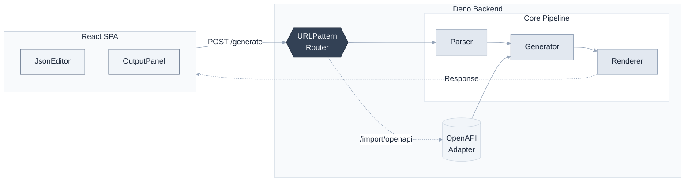

## API Doc Generator

<div align="center">

**Full-stack API documentation generator built with Deno + React**

Generate beautiful Markdown / HTML / JSON docs from OpenAPI specs or custom API definitions

[](https://deno.land)
[](https://react.dev)
[](https://www.typescriptlang.org)
[](LICENSE)

[中文文档](docs/README.zh-CN.md)

</div>

### ✨ Features

- **Multi-format output** — Markdown, HTML, and JSON
- **OpenAPI support** — Import OpenAPI 3.0 / Swagger specs
- **Type-safe** — Full TypeScript with strict mode
- **Full-stack** — Deno backend + React frontend, single deployment
- **RESTful API** — Complete HTTP interface
- **Modern UI** — Tailwind CSS with dark mode

### 🏗️ Architecture



### 📁 Project Structure

```
api-doc-generator/
├── backend/                # Deno backend
│   ├── main.ts            # Entry point
│   ├── router.ts          # URLPattern routes
│   ├── handlers/          # HTTP handlers
│   ├── core/              # Parser + Generator + Renderer
│   ├── adapters/          # OpenAPI adapter
│   ├── middleware/        # Logger
│   ├── shared/            # Shared utilities
│   └── tests/
├── frontend/              # React frontend
│   ├── src/
│   │   ├── components/
│   │   ├── api/           # API client
│   │   └── utils/
│   └── vite.config.ts
├── scripts/dev.sh         # Dev script
├── Dockerfile
└── docker-compose.yml
```

### 🚀 Quick Start

#### Prerequisites

- Deno 2.x
- Node.js 18+

#### One-command setup

```bash
./scripts/dev.sh start      # Start both frontend & backend
./scripts/dev.sh status     # Check status
./scripts/dev.sh stop       # Stop services
./scripts/dev.sh restart    # Restart
```

Visit http://localhost:8080

#### Manual setup

```bash
# Build frontend
cd frontend && npm install && npm run build && cd ..

# Start backend
cd backend && deno task start
```

### 📖 API Usage

#### Generate documentation

```bash
POST /generate?format=markdown|html|json

curl -X POST 'http://localhost:8080/generate?format=markdown' \
  -H 'Content-Type: application/json' \
  -d '{
    "info": { "title": "My API", "version": "1.0.0" },
    "paths": {
      "/users": {
        "get": {
          "summary": "List users",
          "responses": { "200": { "description": "OK" } }
        }
      }
    }
  }'
```

#### Import OpenAPI

```bash
POST /import/openapi?format=markdown
# Send OpenAPI 3.0 JSON directly
```

#### Health check

```bash
GET /health
# → { "status": "ok", "timestamp": "..." }
```

### 🧪 Testing

```bash
cd backend
deno test --allow-net --allow-read --allow-env
```

### 📦 Deployment

#### Docker

```bash
docker-compose up --build

# Or build manually
docker build -t api-doc-generator .
docker run -p 8080:8080 api-doc-generator
```

### 🔧 Configuration

| Variable | Default | Description |
|----------|---------|-------------|
| `PORT` | 8080 | Server port |
| `HOST` | 0.0.0.0 | Server host |

### 🤝 Contributing

Issues and PRs are welcome!

### 📄 License

MIT
