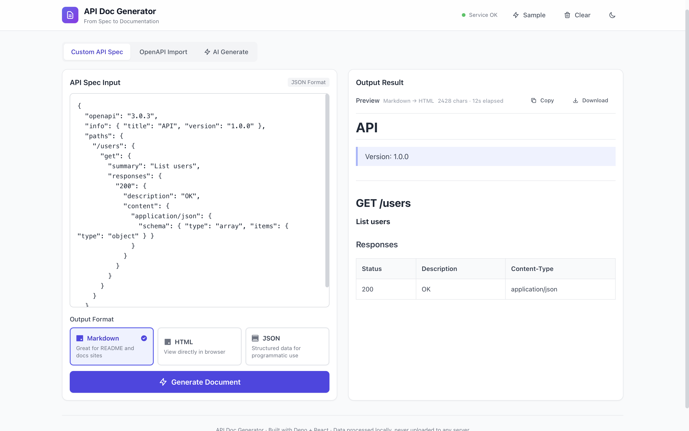
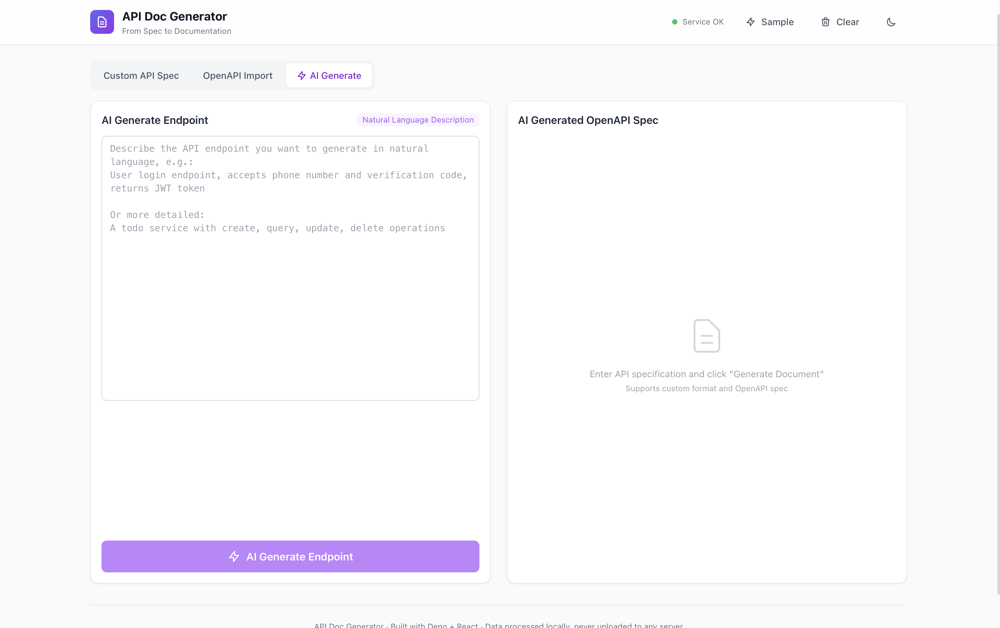
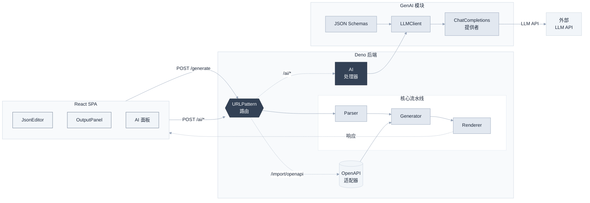

## API 文档生成器

<div align="center">

**基于 Deno + React 的全栈 API 文档生成工具**

支持从 API 规范一键生成 Markdown / HTML / JSON 文档

[](https://deno.land)
[](https://react.dev)
[](https://www.typescriptlang.org)
[](LICENSE)

[English](README.md)

</div>

### ✨ 特性

- **多格式输出** — 支持 Markdown、HTML、JSON 三种格式
- **OpenAPI 支持** — 直接导入 OpenAPI 3.0 / Swagger 规范
- **AI 驱动生成** — 通过 LLM 从自然语言生成 OpenAPI 规范
- **类型安全** — 全模块 TypeScript (strict mode)
- **全栈一体** — Deno 后端 + React 前端，单一部署
- **RESTful API** — 提供完整的 HTTP 接口，包括 AI 端点
- **现代 UI** — Tailwind CSS + 暗色模式，支持普通模式和 AI 模式
- **流式输出** — AI 生成过程实时流式反馈
- **结构化输出** — AI 通过 JSON Schema 严格生成合法 OpenAPI 3.0 JSON

### 🖼️ 界面预览

<table>
  <tr>
    <td align="center" width="50%">
      <br/>
      <em>普通模式</em>
    </td>
    <td align="center" width="50%">
      <br/>
      <em>AI 模式</em>
    </td>
  </tr>
</table>

### 🏗️ 架构




### 🚀 快速开始

#### 前置要求

- Deno 2.x
- Node.js 18+

#### 一键启动

```bash
./scripts/dev.sh start      # 启动前后端
./scripts/dev.sh status     # 查看状态
./scripts/dev.sh stop       # 停止服务
./scripts/dev.sh restart   # 重启
```

访问 http://localhost:8080

#### 手动启动

```bash
# 构建前端
cd frontend && npm install && npm run build && cd ..

# 启动后端
cd backend && deno task start
```

### 📖 API 使用

#### 生成文档

```bash
POST /generate?format=markdown|html|json

curl -X POST 'http://localhost:8080/generate?format=markdown' \
  -H 'Content-Type: application/json' \
  -d '{
    "info": { "title": "My API", "version": "1.0.0" },
    "paths": {
      "/users": {
        "get": {
          "summary": "List users",
          "responses": { "200": { "description": "OK" } }
        }
      }
    }
  }'
```

#### 导入 OpenAPI

```bash
POST /import/openapi?format=markdown
# 直接发送 OpenAPI 3.0 JSON
```

#### AI：Ping（测试 LLM 连接）

```bash
POST /ai/ping
# → { "ok": true, "reply": "...", "model": "...", "usage": {...} }
```

#### AI：从自然语言生成 OpenAPI

```bash
POST /ai/generate-openapi
Content-Type: application/json

{
  "description": "用户管理系统，包含查询用户列表和根据ID查询用户详情",
  "scope": "document"
}

# → { "ok": true, "openapi": {...}, "scope": "document", "usage": {...}, "format_used": "json_schema" }
```

#### AI：流式生成

```bash
POST /ai/generate-openapi-stream
# Server-Sent Events 流式返回生成进度
```

#### 健康检查

```bash
GET /health
# → { "status": "ok", "timestamp": "..." }
```

### 🧪 测试

```bash
cd backend
deno test --allow-net --allow-read --allow-env
```

### 📦 部署

#### Docker

```bash
docker-compose up --build

# 或手动构建
docker build -t api-doc-generator .
docker run -p 8080:8080 api-doc-generator
```

### 🔧 配置

| 变量 | 默认值 | 说明 |
|------|--------|------|
| `PORT` | 8080 | 服务端口 |
| `HOST` | 0.0.0.0 | 服务主机 |
| `OPENAI_API_KEY` | - | LLM API 密钥（AI 功能需要） |
| `OPENAI_BASE_URL` | `https://apihub.agnes-ai.com/v1` | LLM API 基础 URL |
| `LLM_MODEL` | `agnes-2.0-flash` | LLM 模型名称 |
| `LOG_LEVEL` | `info` | 日志级别 |
| `CORS_ALLOWED_ORIGINS` | `http://localhost:5173,...` | CORS 允许的来源 |

复制 `config/env.example` 为 `.env` 并根据需要修改。

### 🤝 贡献

欢迎提交 Issue 和 Pull Request！

### 📄 许可证

MIT License
