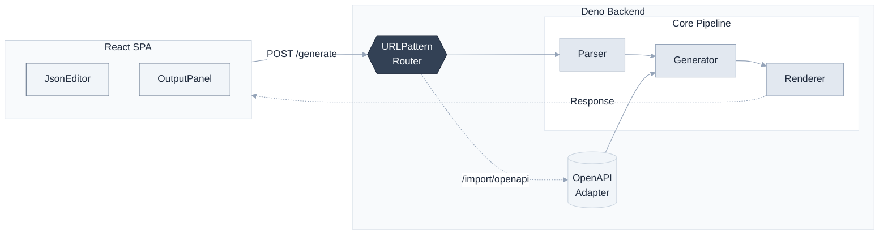

## API 文档生成器

<div align="center">

**基于 Deno + React 的全栈 API 文档生成工具**

支持从 API 规范一键生成 Markdown / HTML / JSON 文档

[](https://deno.land)
[](https://react.dev)
[](https://www.typescriptlang.org)
[](LICENSE)

[English](README.md)

</div>

### ✨ 特性

- **多格式输出** — 支持 Markdown、HTML、JSON 三种格式
- **OpenAPI 支持** — 直接导入 OpenAPI 3.0 / Swagger 规范
- **类型安全** — 全 TypeScript (strict mode)
- **全栈一体** — Deno 后端 + React 前端，单一部署
- **RESTful API** — 提供完整的 HTTP 接口
- **现代 UI** — Tailwind CSS + 暗色模式

### 🏗️ 架构



### 📁 项目结构

```
api-doc-generator/
├── backend/                # Deno 后端
│   ├── main.ts            # 入口
│   ├── router.ts          # URLPattern 路由
│   ├── handlers/          # HTTP 处理器
│   ├── core/              # Parser + Generator + Renderer
│   ├── adapters/          # OpenAPI 适配器
│   ├── middleware/        # 日志中间件
│   ├── shared/            # 共享工具
│   └── tests/
├── frontend/              # React 前端
│   ├── src/
│   │   ├── components/    # UI 组件
│   │   ├── api/           # API 客户端
│   │   └── utils/
│   └── vite.config.ts
├── scripts/dev.sh         # 开发脚本
├── Dockerfile
└── docker-compose.yml
```

### 🚀 快速开始

#### 前置要求

- Deno 2.x
- Node.js 18+

#### 一键启动

```bash
./scripts/dev.sh start      # 启动前后端
./scripts/dev.sh status     # 查看状态
./scripts/dev.sh stop       # 停止服务
./scripts/dev.sh restart    # 重启
```

访问 http://localhost:8080

#### 手动启动

```bash
# 构建前端
cd frontend && npm install && npm run build && cd ..

# 启动后端
cd backend && deno task start
```

### 📖 API 使用

#### 生成文档

```bash
POST /generate?format=markdown|html|json

curl -X POST 'http://localhost:8080/generate?format=markdown' \
  -H 'Content-Type: application/json' \
  -d '{
    "info": { "title": "My API", "version": "1.0.0" },
    "paths": {
      "/users": {
        "get": {
          "summary": "List users",
          "responses": { "200": { "description": "OK" } }
        }
      }
    }
  }'
```

#### 导入 OpenAPI

```bash
POST /import/openapi?format=markdown
# 直接发送 OpenAPI 3.0 JSON
```

#### 健康检查

```bash
GET /health
# → { "status": "ok", "timestamp": "..." }
```

### 🧪 测试

```bash
cd backend
deno test --allow-net --allow-read --allow-env
```

### 📦 部署

#### Docker

```bash
docker-compose up --build

# 或手动构建
docker build -t api-doc-generator .
docker run -p 8080:8080 api-doc-generator
```

### 🔧 配置

| 变量 | 默认值 | 说明 |
|------|--------|------|
| `PORT` | 8080 | 服务端口 |
| `HOST` | 0.0.0.0 | 服务主机 |

### 🤝 贡献

欢迎提交 Issue 和 Pull Request！

### 📄 许可证

MIT License
