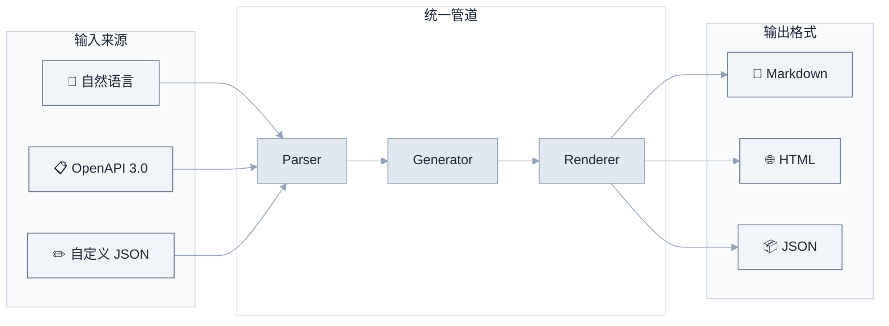
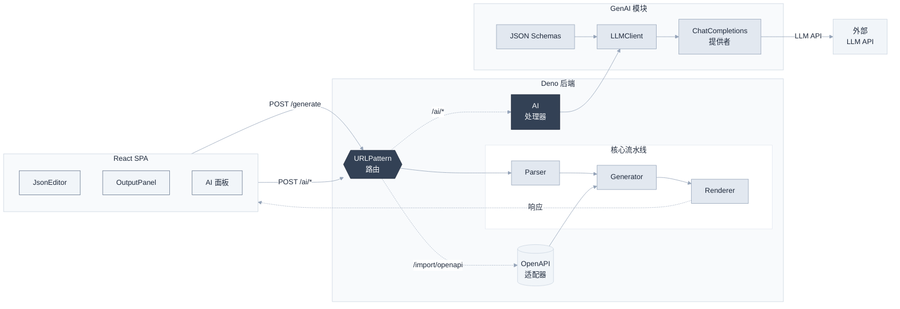

# 🧠 API Doc Generator — AI 驱动的 API 文档生成器

<div align="center">

**用自然语言描述你的 API，几秒钟内生成漂亮的文档。**

从自然语言、OpenAPI 规范或自定义定义 → Markdown / HTML / JSON —— 全部本地运行，数据不出服务器。

[](https://deno.land)
[](https://react.dev)
[](https://www.typescriptlang.org)
[](https://platform.openai.com/docs/guides/structured-outputs)
[](../LICENSE)

[English](../README.md)

</div>

---

## 为什么选择这个工具？

市面上大多数 API 文档工具都要求你**先有** OpenAPI 规范。要么手写（繁琐），要么用笨重的 GUI 编辑器（慢、厂商绑定）。这个工具的定位不同：



**三种输入路径，一条统一管道，零厂商绑定。** 选你觉得最方便的那条。

### 竞品对比

|  | API Doc Generator | Swagger UI | Redoc | Postman | Stoplight |
|---|---|---|---|---|---|
| **自然语言 → 文档** | ✅ AI 驱动 | ❌ | ❌ | ⚠️ AI Agent（云端） | ❌ |
| **自定义规范格式** | ✅ 简洁 JSON | ❌ | ❌ | ❌ | ❌ |
| **导入 OpenAPI 3.0** | ✅ | ✅ | ✅ | ✅ | ✅ |
| **输出 Markdown** | ✅ | ❌ | ❌ | ❌ | ❌ |
| **输出 HTML** | ✅ 精美单页 | ✅ 交互式 | ✅ 精美 | ⚠️ 发布门户 | ✅ 交互式 |
| **输出 JSON** | ✅ | ❌ | ❌ | ❌ | ❌ |
| **流式 AI 生成** | ✅ SSE | ❌ | ❌ | ❌ | ❌ |
| **可自托管** | ✅ docker-compose up | ✅ | ✅ | ⚠️ SaaS + 本地 MCP | ⚠️ 仅企业版 |
| **开源** | ✅ MIT | ✅ Apache 2.0 | ✅ MIT | ❌ | ❌ |
| **轻量** | ✅ ~7k 行代码 | ✅ | ✅ | ❌ | ❌ |

> **说明：**
> - **Swagger UI** 是开源渲染器。其母公司 SmartBear 于 2025 年推出了 AI 驱动的规范生成功能，但那是独立的云产品（SwaggerHub），不是 Swagger UI 本身。
> - **Postman** 推出了 Agent Mode（AI）用于文档生成，但消耗 AI 点数且在 Postman 云端运行。MCP 服务器已开源可在本地桥接，但核心平台是私有 SaaS。
> - **Redoc** 支持在 OpenAPI description 字段中渲染 Markdown，但**不能**输出独立的 `.md` 文件。
> - **Stoplight** 为私有 SaaS 产品。自托管 Git 集成需要企业版（定制报价）。

### ✨ 特性

- **🧠 AI 驱动生成** — 用自然语言描述 API，AI 自动生成符合 OpenAPI 3.0 规范的 JSON。基于 JSON Schema 结构化输出确保正确性，带自动降级和本地验证。
- **📋 OpenAPI 导入** — 已有 OpenAPI 规范？粘贴进来即可生成文档。
- **✏️ 自定义规范格式** — 当你不需要 OpenAPI 的全部复杂度时，一个轻量级的 JSON 格式就够用。
- **📄 多格式输出** — 生成整洁的 Markdown、精美的独立 HTML 或机器可读的 JSON。
- **⚡ 流式 AI 生成** — 通过 SSE 实时观看 AI 生成 API 规范，显示实时字符数和耗时。
- **🌙 暗色模式** — 整个 UI 支持完整的亮/暗主题切换。
- **🐳 一键部署** — `docker-compose up --build` 即可运行。
- **🔒 数据不出服务器** — 所有处理在本地完成，不上云、无追踪、无厂商绑定。
- **🏗️ 清晰架构** — Deno 后端 + React 前端 + 独立 GenAI 模块，每层可独立测试。
- **✅ 生产级 CI** — GitHub Actions：fmt → lint → type-check → test → build，每个 PR 自动运行。

### 🖼️ 界面预览

<table>
  <tr>
    <td align="center" width="50%">
      <br/>
      <em>普通模式 — 粘贴规范，生成文档</em>
    </td>
    <td align="center" width="50%">
      <br/>
      <em>AI 模式 — 自然语言描述，实时生成</em>
    </td>
  </tr>
</table>

### 🏗️ 架构



### 🚀 快速开始

#### 前置要求

- Deno 2.x
- Node.js 18+

#### 一键启动

```bash
./scripts/dev.sh start      # 启动前后端
./scripts/dev.sh status     # 查看状态
./scripts/dev.sh stop       # 停止服务
./scripts/dev.sh restart    # 重启
```

访问 **http://localhost:8080**

#### 手动启动

```bash
# 构建前端
cd frontend && npm install && npm run build && cd ..

# 启动后端
cd backend && deno task start
```

### 📖 API 使用

#### 生成文档

```bash
POST /generate?format=markdown|html|json

curl -X POST 'http://localhost:8080/generate?format=markdown' \
  -H 'Content-Type: application/json' \
  -d '{
    "info": { "title": "My API", "version": "1.0.0" },
    "paths": {
      "/users": {
        "get": {
          "summary": "查询用户列表",
          "responses": { "200": { "description": "OK" } }
        }
      }
    }
  }'
```

#### 导入 OpenAPI

```bash
POST /import/openapi?format=markdown
# 直接发送 OpenAPI 3.0 JSON
```

#### AI：Ping（测试 LLM 连接）

```bash
POST /ai/ping
# → { "ok": true, "reply": "...", "model": "...", "usage": {...} }
```

#### AI：从自然语言生成 OpenAPI

```bash
POST /ai/generate-openapi
Content-Type: application/json

{
  "description": "用户管理系统，包含查询用户列表和根据ID查询用户详情",
  "scope": "document"
}

# → { "ok": true, "openapi": {...}, "scope": "document", "usage": {...}, "format_used": "json_schema" }
```

#### AI：流式生成

```bash
POST /ai/generate-openapi-stream
# Server-Sent Events 流式返回生成进度
```

#### 健康检查

```bash
GET /health
# → { "status": "ok", "timestamp": "..." }
```

### 🧪 测试

```bash
# 后端测试
cd backend && deno test --allow-net --allow-read --allow-env

# GenAI 测试
cd genai && deno test --allow-net --allow-read --allow-env
```

### 📦 部署

#### Docker

```bash
docker-compose up --build

# 或手动构建
docker build -t api-doc-generator .
docker run -p 8080:8080 api-doc-generator
```

### 🔧 配置

| 变量 | 默认值 | 说明 |
|------|--------|------|
| `PORT` | 8080 | 服务端口 |
| `HOST` | 0.0.0.0 | 服务主机 |
| `OPENAI_API_KEY` | - | LLM API 密钥（AI 功能必需） |
| `OPENAI_BASE_URL` | `https://apihub.agnes-ai.com/v1` | LLM API 基础 URL |
| `LLM_MODEL` | `agnes-2.0-flash` | LLM 模型名称 |
| `LOG_LEVEL` | `info` | 日志级别 |
| `CORS_ALLOWED_ORIGINS` | `http://localhost:5173,...` | CORS 允许的来源 |

复制 `config/env.example` 为 `.env` 并根据需要修改。

### 🗺️ 路线图

| 状态 | 功能 |
|------|------|
| 📋 | **多 LLM 提供商** — OpenAI、Anthropic、Ollama |
| 📋 | **Swagger 2.0 导入** — 支持旧版规范 |
| 📋 | **OpenAPI 文件上传** — UI 中直接上传 `.json`/`.yaml` |
| 📋 | **YAML 输出** — 支持 YAML 格式输出文档 |
| 📋 | **CLI 模式** — `npx api-doc-gen spec.json -f markdown` |
| 📋 | **自定义模板** — 用户自定义输出模板 (Handlebars) |
| 📋 | **Postman 集合导出** — 导出为 Postman 集合 |

详见完整 [路线图](../ROADMAP.md)。

### 🤝 贡献

欢迎贡献！无论是修 bug、添加 LLM 提供商还是改进文档，我们都很乐意接受。

详见 [CONTRIBUTING.zh-CN.md](CONTRIBUTING.zh-CN.md) 了解开发环境搭建、代码规范和 PR 流程。

可以关注标记为 [`good-first-issue`](https://github.com/phaethix/api-doc-generator/labels/good-first-issue) 的 issue 来快速上手。

### 📄 许可证

MIT — 随意使用、修改、发布。

---

<div align="center">
  <sub>基于 Deno + React + TypeScript 构建 · AI 驱动 · 隐私优先</sub>
</div>
