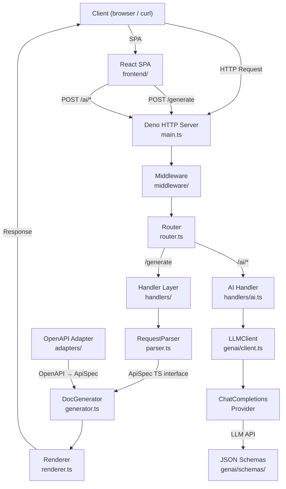
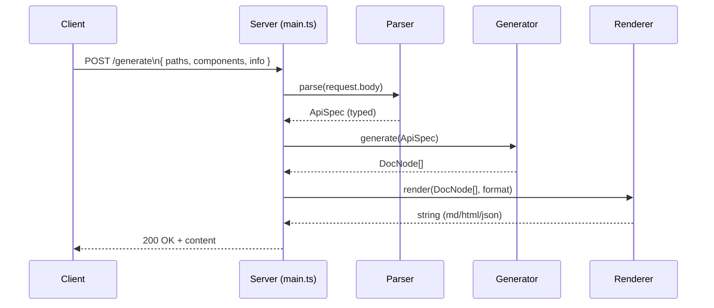
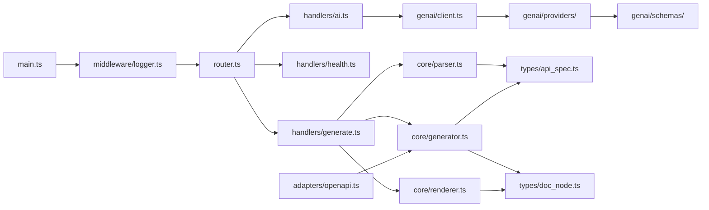
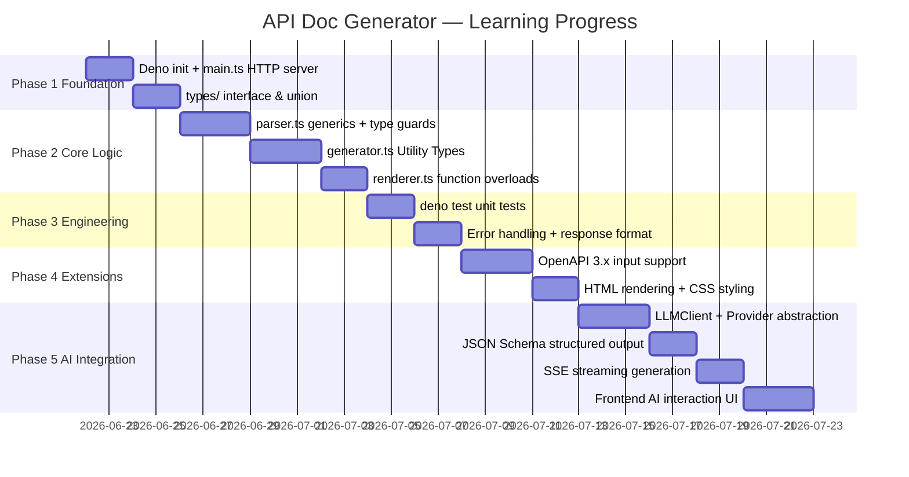

# API Doc Generator — Whitepaper

> A full-stack API documentation generator built with Deno + TypeScript
> Goal: project-driven learning — systematically master TypeScript, the Deno ecosystem, and AI application development

> 🌐 [中文版 (Chinese Version)](api-doc-generator-whitepaper.zh-CN.md)

---

## 1. Project Positioning

`api-doc-generator` is a full-stack HTTP service that accepts structured API definitions or natural language descriptions, automatically generates standardized API documentation (Markdown / HTML / JSON), and supports AI-powered OpenAPI spec generation from scratch.

Dual learning objectives:

1. **TypeScript Engineering** — Deliberate coverage of core TS features: type system, generics, type guards, function overloads, modularization, and integration with the Deno standard library
2. **AI Application Development** — Hands-on mastery of AI engineering through LLM Client encapsulation, Provider abstraction, JSON Schema structured output, SSE streaming, and more

---

## 2. Technology Choices

| Dimension | Choice | Rationale |
|---|---|---|
| Runtime | Deno 2.x | Native TS support, no webpack/tsc config; built-in standard library |
| Language | TypeScript (strict mode) | Core learning objective |
| HTTP framework | Deno built-in `Deno.serve` | Zero dependencies; raw request/response model |
| Frontend | React 18 + Tailwind CSS | Vite build, component-based SPA |
| AI/LLM | OpenAI-compatible API | Provider abstraction supports any compatible LLM |
| Testing | `deno test` | Built-in assertions, no extra configuration |
| Package management | `deno.json` imports | Replaces npm; dependencies via URL/JSR |

---

## 3. System Architecture



---

## 4. Core Data Flow



---

## 5. Directory Structure

```
api-doc-generator/
├── backend/
│   ├── deno.json
│   ├── main.ts
│   ├── router.ts
│   ├── types/
│   │   ├── api_spec.ts
│   │   └── doc_node.ts
│   ├── handlers/
│   │   ├── generate.ts
│   │   ├── health.ts
│   │   ├── openapi.ts
│   │   └── ai.ts
│   ├── core/
│   │   ├── parser.ts
│   │   ├── generator.ts
│   │   └── renderer.ts
│   ├── middleware/
│   │   └── logger.ts
│   ├── adapters/
│   │   └── openapi.ts
│   └── tests/
│       ├── parser_test.ts
│       ├── generator_test.ts
│       ├── renderer_test.ts
│       ├── integration_test.ts
│       └── openapi_test.ts
├── genai/
│   ├── client.ts              # LLMClient encapsulation
│   ├── types.ts               # Provider interface definitions
│   ├── errors.ts              # LLMError error classification
│   ├── openapi.ts             # OpenAPI generator
│   ├── index.ts               # Public exports
│   ├── providers/
│   │   └── chat_completions.ts # OpenAI-compatible Provider
│   ├── schemas/
│   │   ├── endpoint.ts        # Single endpoint JSON Schema
│   │   └── document.ts        # Full document JSON Schema
│   └── tests/
│       ├── client_test.ts
│       └── openapi_test.ts
├── frontend/
│   └── src/
│       ├── components/        # React components
│       ├── api/               # API client
│       └── utils/             # Utility functions
└── docs/
    └── api-doc-generator-whitepaper.md
```

---

## 6. TypeScript Core Concepts

This project deliberately arranges different TS features by module, ensuring a coherent learning path:

### 6.1 Type System Fundamentals (`types/api_spec.ts`)

```typescript
// Choosing between interface vs type alias
interface Operation {
  summary: string;
  description?: string;          // Optional property
  parameters: Parameter[];
  requestBody?: RequestBody;
  responses: Record<string, Response>; // Index signature
}

// Literal union types
type HttpMethod = "GET" | "POST" | "PUT" | "DELETE" | "PATCH";

// Enum (vs union type — when to use each)
enum OutputFormat {
  Markdown = "markdown",
  HTML     = "html",
  JSON     = "json",
}
```

**Key learning**: `interface` vs `type` differences; optional vs required; `Record<K,V>` semantics.

---

### 6.2 Generics (`core/parser.ts`)

```typescript
// Generic function: parsing + type guard composition
function parseBody<T>(raw: unknown, guard: (x: unknown) => x is T): T {
  if (!guard(raw)) {
    throw new TypeError("Request body does not match expected schema");
  }
  return raw;
}

// Type Guard
function isApiSpec(x: unknown): x is ApiSpec {
  return (
    typeof x === "object" &&
    x !== null &&
    "info" in x &&
    "paths" in x
  );
}
```

**Key learning**: `<T>` syntax; `is` type predicate; correct usage of `unknown` vs `any`.

---

### 6.3 Utility Types (`core/generator.ts`)

```typescript
// Practical use of Partial / Required / Readonly / Pick / Omit
type OperationSummary = Pick<Operation, "summary" | "description">;
type ReadonlySpec    = Readonly<ApiSpec>;

// Conditional types
type Flatten<T> = T extends Array<infer Item> ? Item : T;
// Flatten<string[]> → string
// Flatten<number>   → number
```

---

### 6.4 Function Overloads (`core/renderer.ts`)

```typescript
// Overload signatures (improvement: all overloads return string)
function render(nodes: DocNode[], format: "markdown"): string;
function render(nodes: DocNode[], format: "html"):     string;
function render(nodes: DocNode[], format: "json"):     string;

// Implementation signature
function render(nodes: DocNode[], format: OutputFormat): string {
  switch (format) {
    case "markdown": return renderMarkdown(nodes);
    case "html":     return renderHTML(nodes);
    case "json":     return renderJSON(nodes);
  }
}
```

---

### 6.5 Async & Error Handling (`handlers/generate.ts`)

```typescript
export async function handleGenerate(req: Request): Promise<Response> {
  try {
    // ... parse, generate, render
    return new Response(output, { status: 200, headers: { ... } });
  } catch (e) {
    if (e instanceof ParseError) {
      return new Response(..., { status: 400 });  // Precise error
    }
    if (e instanceof GenerateError) {
      return new Response(..., { status: e.status });
    }
    console.error("Unexpected error:", e);
    return new Response(..., { status: 500 });     // True internal error
  }
}
```

---

## 7. AI Development Concepts

The AI module (`genai/`) is the second core learning objective. By building a complete LLM integration layer, you master the following AI engineering skills:

### 7.1 Provider Abstraction Pattern (`genai/types.ts`)

```typescript
// Interface-oriented programming: LLMClient depends only on Provider interface
export interface Provider {
  chat(req: ChatRequest): Promise<ChatResponse>;
  streamChat?(req: ChatRequest): Promise<ReadableStream<string>>;
}

// Dependency Inversion Principle (DIP) in action:
// LLMClient → Provider interface ← ChatCompletionsProvider
// Adding a new LLM backend only requires implementing Provider — no client changes
```

**Key learning**: Interface abstraction, dependency inversion, testability (mock provider = unit test).

---

### 7.2 LLMClient Encapsulation (`genai/client.ts`)

```typescript
export class LLMClient {
  constructor(private provider: Provider) {}

  async complete(req: ChatRequest): Promise<ChatResponse> {
    this.validate(req);  // Request validation — avoid wasted API calls
    return await this.provider.chat(req);
  }

  async streamComplete(req: ChatRequest): Promise<ReadableStream<string>> {
    this.validate(req);
    if (!this.provider.streamChat) {
      throw new Error("Provider does not support streaming");
    }
    return await this.provider.streamChat(req);
  }

  private validate(req: ChatRequest): void {
    // temperature range, maxTokens validity, etc.
  }
}
```

**Key learning**: Facade pattern, input validation, streaming vs non-streaming API design.

---

### 7.3 JSON Schema Structured Output (`genai/schemas/`)

```typescript
// Constrain LLM output with JSON Schema — guarantees valid OpenAPI 3.0 JSON
export const endpointSchema = {
  type: "object",
  properties: {
    method: { type: "string", enum: ["GET","POST","PUT","PATCH","DELETE"] },
    path: { type: "string", pattern: "^/[a-zA-Z0-9_/{}-]+$" },
    summary: { type: "string" },
    responses: { type: "object" },
  },
  required: ["method", "path", "summary", "responses"],
  additionalProperties: false,
};

// With json_schema response_format, LLM output is 100% schema-compliant
```

**Key learning**: JSON Schema design, `response_format` mechanism, `json_schema` vs `json_object` selection and fallback strategies.

---

### 7.4 Streaming Output (SSE) (`genai/providers/chat_completions.ts`)

```typescript
// Parse OpenAI-compatible SSE stream
async *parseSSEStream(body: ReadableStream<Uint8Array>): AsyncGenerator<string> {
  for await (const chunk of readLines(body)) {
    if (chunk.startsWith("data: ")) {
      const data = chunk.slice(6);
      if (data === "[DONE]") return;
      const parsed = JSON.parse(data);
      yield parsed.choices?.[0]?.delta?.content ?? "";
    }
  }
}
```

**Key learning**: AsyncGenerator, ReadableStream processing, SSE protocol parsing, flow control and cancellation (AbortController).

---

### 7.5 Error Classification & Recovery (`genai/errors.ts`)

```typescript
export class LLMError extends Error {
  constructor(
    message: string,
    public category: "auth" | "rate_limit" | "server" | "network" | "unknown",
    public status?: number,
    public source?: string,
  ) {
    super(message);
    this.name = "LLMError";
  }
}

// Auto-classify by HTTP status code
function classifyStatus(status: number): LLMError["category"] {
  if (status === 401 || status === 403) return "auth";
  if (status === 429) return "rate_limit";
  if (status >= 500) return "server";
  return "unknown";
}
```

**Key learning**: Custom Error types, error classification patterns, graceful degradation and user messaging.

---

### 7.6 Post-processing & Auto-fix (`genai/openapi.ts`)

```typescript
// AI output isn't always perfect — auto-fix known common issues
function validateAndFixPath(parsed: Record<string, unknown>): void {
  const path = parsed.path as string;
  // Fix: empty path → infer from description
  if (!path || path === "/") {
    const inferred = inferPathFromDescription(description);
    parsed.path = inferred;
  }
  // Fix: missing leading /
  if (!path.startsWith("/")) {
    parsed.path = "/" + path;
  }
}
```

**Key learning**: Defensive programming, handling AI output uncertainty, auto-fix vs error trade-offs.

---

### 7.7 Fallback Mechanism

```
json_schema → (400 unsupported) → json_object → (400 unsupported) → text
```

When the LLM doesn't support strict structured output, auto-degrade to a looser mode, and annotate the response with the actual `format_used`. This is the "graceful degradation" practice in AI engineering.

---

## 8. Module Relationship Diagram



---

## 9. Learning Milestones



---

## 10. API Specification

### `POST /generate`

**Request Body** (JSON):

```json
{
  "info": { "title": "My API", "version": "1.0.0" },
  "paths": {
    "/users": {
      "get": {
        "summary": "List users",
        "parameters": [
          { "name": "page", "in": "query", "schema": { "type": "integer" } }
        ],
        "responses": {
          "200": { "description": "Success" }
        }
      }
    }
  }
}
```

**Query Parameters**:

| Parameter | Type | Default | Description |
|---|---|---|---|
| `format` | `markdown \| html \| json` | `markdown` | Output format |

**Request Headers**:

| Header | Description |
|---|---|
| `Accept` | Content Negotiation: `text/markdown`, `text/html`, `application/json` (takes priority over query param) |

**Response**: Generated documentation string.

---

### `GET /health`

```json
{ "status": "ok", "timestamp": "2026-06-22T10:00:00Z" }
```

---

### `POST /ai/ping`

Test LLM connection:

```json
// Response
{ "ok": true, "reply": "pong", "model": "agnes-2.0-flash", "usage": {...} }
```

---

### `POST /ai/generate-openapi`

Generate OpenAPI spec from natural language (non-streaming):

```json
// Request
{ "description": "User management system with CRUD operations", "scope": "document" }

// Response
{ "ok": true, "openapi": {...}, "scope": "document", "usage": {...}, "format_used": "json_schema" }
```

---

### `POST /ai/generate-openapi-stream`

Streaming generation (SSE) with real-time progress:

```
event: delta
data: {"type":"delta","content":"..."}

event: done
data: {"type":"done","result":{"openapi":{...},"format_used":"json_schema"}}
```

---

## 11. How to Run

```bash
# Development (hot reload)
deno task dev

# Production
deno task start
# or
deno run --allow-net main.ts

# Run tests
deno task test
# or
deno test

# Example API call
curl -X POST http://localhost:8080/generate?format=markdown \
  -H "Content-Type: application/json" \
  -d '{"info":{"title":"Demo","version":"1.0"},"paths":{"/ping":{"get":{"summary":"Ping","responses":{"200":{"description":"pong"}}}}}}'
```

---

## 12. Learning Path Reference

| Stage | File | Core Concepts |
|---|---|---|
| 1 | `types/api_spec.ts` | `interface`, `type`, literal unions, `Record` |
| 2 | `core/parser.ts` | Generics `<T>`, type guards `is`, `unknown` |
| 3 | `core/generator.ts` | Utility Types, conditional types `infer` |
| 4 | `core/renderer.ts` | Function overloads, `switch` type narrowing |
| 5 | `handlers/generate.ts` | `async/await`, `Promise<Response>`, error classification |
| 6 | `router.ts` | `URLPattern` Web Standard routing |
| 7 | `middleware/logger.ts` | Request logging, duration tracking, middleware pattern |
| 8 | `adapters/openapi.ts` | Adapter pattern, OpenAPI → ApiSpec conversion |
| 9 | `tests/*_test.ts` | `Deno.test`, `assertEquals`, integration testing |
| 10 | `genai/types.ts` | Interface abstraction, dependency inversion, Provider pattern |
| 11 | `genai/client.ts` | Facade pattern, input validation, streaming/non-streaming dual mode |
| 12 | `genai/providers/` | OpenAI API protocol, SSE parsing, error classification |
| 13 | `genai/schemas/` | JSON Schema design, structured output constraints |
| 14 | `genai/openapi.ts` | AI output post-processing, auto-fix, fallback strategies |

---

## 13. Design Improvements

The following improvements were identified and applied during implementation, bringing the project closer to production standards while preserving learning objectives:

| # | Improvement | Description |
|---|-------------|-------------|
| 1 | Error classification | ParseError(400), GenerateError(custom), unknown(500+log) |
| 2 | Multi-level type validation | isApiInfo → isPathItem → isOperation recursive validation |
| 3 | Renderer unified return type | Removed inconsistency of JSON returning object |
| 4 | Content Negotiation | Accept header fallback + query param |
| 5 | Request logging middleware | Records duration, method, path, status |
| 6 | URLPattern routing | Web Standard, exact method + path matching |
| 7 | Independent OpenAPI adapter | adapters/ directory, adapter pattern, non-invasive |
| 8 | Recursive Schema conversion | Supports nested object and array types |
| 9 | HTML inline CSS styling | Phase 4 goal implemented directly in core renderer |
| 10 | Utility Types in practice | Pick/Readonly used for actual business logic |
| 11 | New middleware/ layer | Decouples logging, error handling from business logic |
| 12 | Function overloads unified return | render() — all overloads return string |

---

> **TL;DR**: This project's value isn't the documentation generation itself — it's that every backend module is a deliberate TypeScript exercise, and the AI module is a complete LLM engineering practice: Provider abstraction, structured output, streaming responses, error recovery, and fallback strategies. Read the code, and you'll grasp both the TS type system and AI application development fundamentals.
