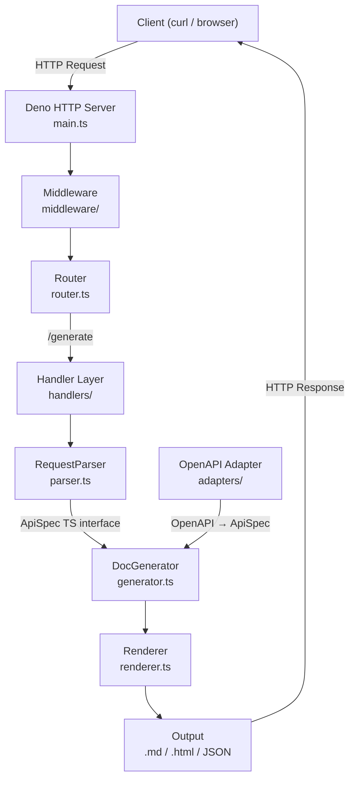
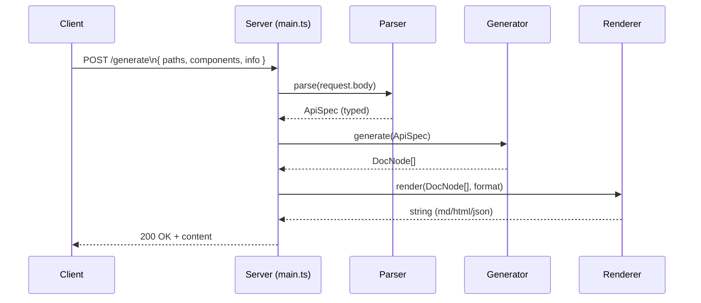
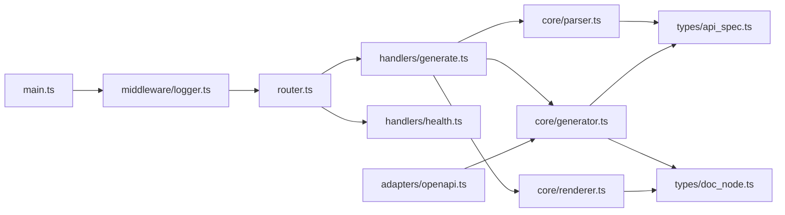
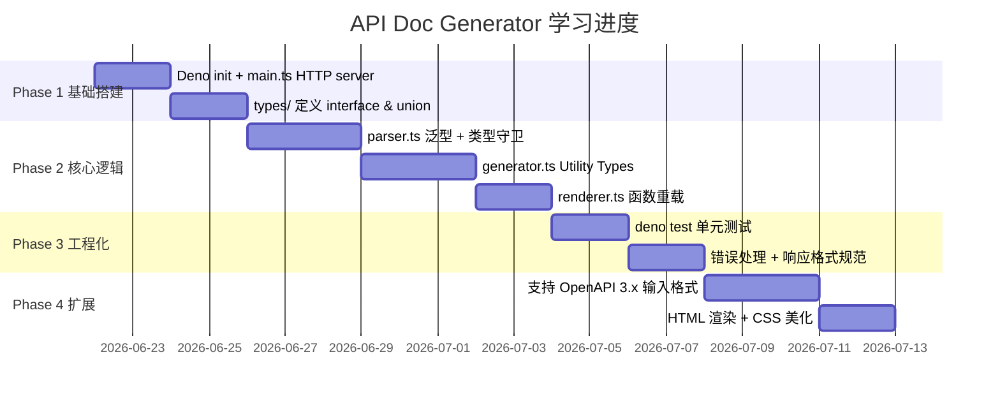

# API Doc Generator — 白皮书

> 一个基于 Deno + TypeScript 的 HTTP 服务生成器学习项目
> 目标：在构建真实可运行项目的过程中，系统掌握 TypeScript 核心语法与 Deno 生态

---

## 1. 项目定位

`api-doc-generator` 是一个轻量 HTTP 服务，接收描述 API 接口的结构化输入，自动生成标准化的接口文档（Markdown / HTML / JSON Schema）。

作为 **TypeScript 学习载体**，它刻意覆盖了 TS 最核心的语言特性：类型系统、泛型、装饰器、模块化，以及与 Deno 标准库的协作方式。

---

## 2. 技术选型

| 维度 | 选择 | 原因 |
|---|---|---|
| 运行时 | Deno 2.x | 原生 TS 支持，无需 webpack/tsc 配置；内置标准库 |
| 语言 | TypeScript (strict mode) | 项目核心学习目标 |
| HTTP 框架 | Deno 内置 `Deno.serve` | 零依赖，感受最原始的请求/响应模型 |
| 测试 | `deno test` | 内置断言库，无额外配置 |
| 包管理 | `deno.json` imports | 替代 npm，用 URL/JSR 引入依赖 |

---

## 3. 系统架构



---

## 4. 核心数据流



---

## 5. 目录结构

```
api-doc-generator/
├── deno.json
├── main.ts
├── router.ts
├── types/
│   ├── api_spec.ts
│   └── doc_node.ts
├── handlers/
│   ├── generate.ts
│   └── health.ts
├── core/
│   ├── parser.ts
│   ├── generator.ts
│   └── renderer.ts
├── middleware/
│   └── logger.ts
├── adapters/
│   └── openapi.ts
└── tests/
    ├── parser_test.ts
    ├── generator_test.ts
    ├── renderer_test.ts
    ├── integration_test.ts
    └── openapi_test.ts
```

---

## 6. TypeScript 核心知识点覆盖

本项目按模块刻意安排了不同的 TS 特性，确保学习路径连贯：

### 6.1 类型系统基础（`types/api_spec.ts`）

```typescript
// interface vs type alias 的选择
interface Operation {
  summary: string;
  description?: string;          // 可选属性
  parameters: Parameter[];
  requestBody?: RequestBody;
  responses: Record<string, Response>; // 索引签名
}

// 字面量联合类型
type HttpMethod = "GET" | "POST" | "PUT" | "DELETE" | "PATCH";

// 枚举（对比 union type 的适用场景）
enum OutputFormat {
  Markdown = "markdown",
  HTML     = "html",
  JSON     = "json",
}
```

**学习重点**：`interface` 与 `type` 的差异；可选 vs 必选；`Record<K,V>` 的语义。

---

### 6.2 泛型（`core/parser.ts`）

```typescript
// 泛型函数：解析 + 类型守卫组合
function parseBody<T>(raw: unknown, guard: (x: unknown) => x is T): T {
  if (!guard(raw)) {
    throw new TypeError("Request body does not match expected schema");
  }
  return raw;
}

// 类型守卫（Type Guard）
function isApiSpec(x: unknown): x is ApiSpec {
  return (
    typeof x === "object" &&
    x !== null &&
    "info" in x &&
    "paths" in x
  );
}
```

**学习重点**：`<T>` 语法；`is` 类型谓词；`unknown` vs `any` 的正确使用姿势。

---

### 6.3 Utility Types（`core/generator.ts`）

```typescript
// Partial / Required / Readonly / Pick / Omit 的实际应用
// (在 core/generator.ts 中实际使用)
type OperationSummary = Pick<Operation, "summary" | "description">;
type ReadonlySpec    = Readonly<ApiSpec>;
// buildEndpoint 使用 OperationSummary 提取字段
// generate 函数参数使用 Readonly<ApiSpec>

// 条件类型
type Flatten<T> = T extends Array<infer Item> ? Item : T;
// Flatten<string[]>  → string
// Flatten<number>    → number
```

---

### 6.4 函数重载（`core/renderer.ts`）

```typescript
// 重载签名（改进：所有重载统一返回 string）
function render(nodes: DocNode[], format: "markdown"): string;
function render(nodes: DocNode[], format: "html"):     string;
function render(nodes: DocNode[], format: "json"):     string;

// 实现签名
function render(nodes: DocNode[], format: OutputFormat): string {
  switch (format) {
    case "markdown": return renderMarkdown(nodes);
    case "html":     return renderHTML(nodes);
    case "json":     return renderJSON(nodes);
  }
}
```

---

### 6.5 异步与错误处理（`handlers/generate.ts`）

```typescript
export async function handleGenerate(req: Request): Promise<Response> {
  try {
    // ... parse, generate, render
    return new Response(output, { status: 200, headers: { ... } });
  } catch (e) {
    if (e instanceof ParseError) {
      return new Response(..., { status: 400 });  // 精确到字段
    }
    if (e instanceof GenerateError) {
      return new Response(..., { status: e.status });
    }
    console.error("Unexpected error:", e);
    return new Response(..., { status: 500 });     // 真·内部错误
  }
}
```

---

## 7. 模块关系图



---

## 8. 学习里程碑



---

## 9. API 接口规范

### `POST /generate`

**请求体**（JSON）：

```json
{
  "info": { "title": "My API", "version": "1.0.0" },
  "paths": {
    "/users": {
      "get": {
        "summary": "List users",
        "parameters": [
          { "name": "page", "in": "query", "schema": { "type": "integer" } }
        ],
        "responses": {
          "200": { "description": "Success" }
        }
      }
    }
  }
}
```

**Query 参数**：

| 参数 | 类型 | 默认 | 说明 |
|---|---|---|---|
| `format` | `markdown \| html \| json` | `markdown` | 输出格式 |

**请求头**：

| 头 | 说明 |
|---|---|
| `Accept` | Content Negotiation: `text/markdown`、`text/html`、`application/json`（优先级高于 query param） |

**响应**：生成的文档字符串。

---

### `GET /health`

```json
{ "status": "ok", "timestamp": "2026-06-22T10:00:00Z" }
```

---

## 10. 运行方式

```bash
# 初始化（已完成）
deno init api-doc-generator
cd api-doc-generator

# 开发（热重载）
deno task dev

# 生产运行
deno task start
# 或
deno run --allow-net main.ts

# 运行测试
deno task test
# 或
deno test

# 调用示例
curl -X POST http://localhost:8080/generate?format=markdown \
  -H "Content-Type: application/json" \
  -d '{"info":{"title":"Demo","version":"1.0"},"paths":{"/ping":{"get":{"summary":"Ping","responses":{"200":{"description":"pong"}}}}}}'
```

---

## 11. TypeScript 学习路线对照

| 阶段 | 文件 | 核心概念 |
|---|---|---|
| 1 | `types/api_spec.ts` | `interface`、`type`、字面量联合、`Record` |
| 2 | `core/parser.ts` | 泛型 `<T>`、类型守卫 `is`、`unknown` |
| 3 | `core/generator.ts` | `Utility Types`、条件类型 `infer` |
| 4 | `core/renderer.ts` | 函数重载、`switch` 类型收窄 |
| 5 | `handlers/generate.ts` | `async/await`、`Promise<Response>`、错误分类处理 |
| 6 | `router.ts` | `URLPattern` Web Standard 路由 |
| 7 | `middleware/logger.ts` | 请求日志、耗时记录、中间件模式 |
| 8 | `adapters/openapi.ts` | 适配器模式、OpenAPI → ApiSpec 转换 |
| 9 | `tests/*_test.ts` | `Deno.test`、`assertEquals`、集成测试 |

---

## 12. 设计改进

以下改进在实现过程中识别并应用，使项目在保留学习目标的同时更接近生产标准：

| # | 改进 | 说明 |
|---|------|------|
| 1 | 错误分类处理 | ParseError(400)、GenerateError(自定义)、未知错误(500+log) |
| 2 | 多层级类型校验 | isApiInfo → isPathItem → isOperation 递归校验 |
| 3 | Renderer 统一返回 string | 去掉 JSON 返回 object 的不一致 |
| 4 | Content Negotiation | Accept header 回退 + query param |
| 5 | 请求日志中间件 | 记录耗时、method、path、status |
| 6 | URLPattern 路由 | Web Standard，method + path 精确匹配 |
| 7 | OpenAPI 适配器独立 | adapters/ 目录，适配器模式，不侵入核心 |
| 8 | 递归 Schema 转换 | 支持嵌套 object 和 array 类型 |
| 9 | HTML 内联 CSS 美化 | Phase 4 目标直接在核心渲染器中实现 |
| 10 | Utility Types 实际使用 | Pick/Readonly 用于实际业务逻辑 |
| 11 | 新增 middleware/ 层 | 日志、错误处理与业务逻辑解耦 |
| 12 | 函数重载统一返回类型 | render() 所有重载返回 string |

---

> **一句话总结**：这个项目的价值不在文档生成本身，而在于每一层模块都是一道 TypeScript 特性的刻意练习题 —— 读完代码，TS 类型系统的核心就基本通了。
